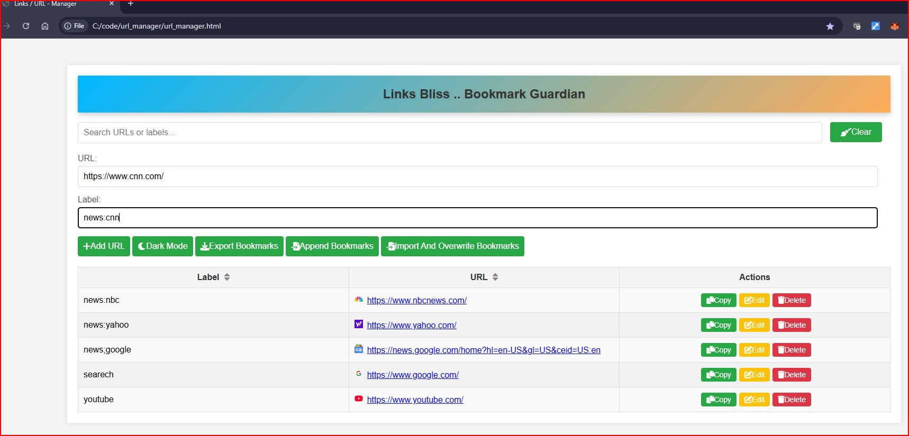
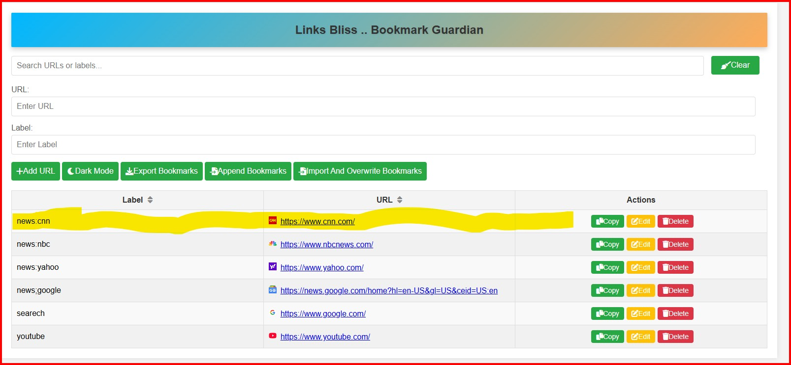
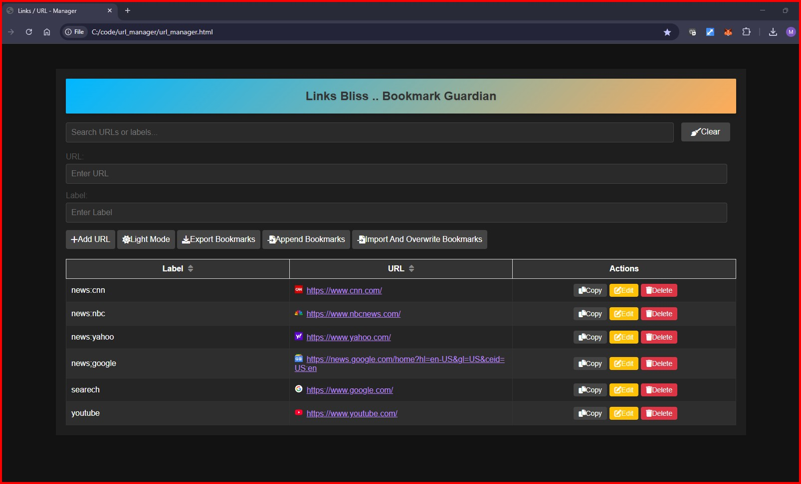
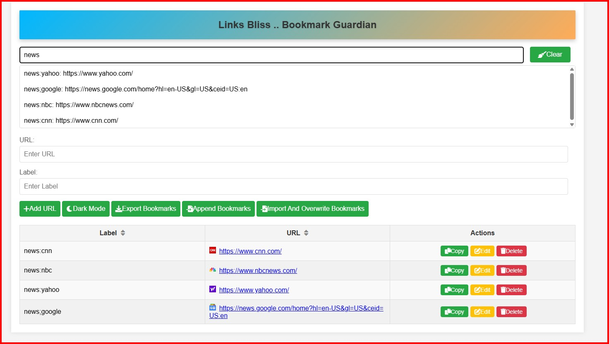

# 🔒 Links Bliss (URL Manager) - Privacy-First Bookmark Guardian - A single HTML page

**Your Ultimate Offline Bookmark Manager - Zero Servers, Zero Tracking, Total Control**

A lightweight, client-side bookmark manager with search, sorting, and dark mode support. Manage your URLs locally with ease!
A **100% client-side** bookmark management solution that prioritizes your digital safety while delivering enterprise-grade organization capabilities. Built for security-conscious users who value privacy without compromising functionality.


 

## 🛡️ Why Security-Conscious Users Love Links Bliss

### **Fortress-Grade Data Protection**
- 📁 **Zero Server Interaction** - Runs entirely in your browser
- 🔐 **LocalStorage Encryption** - Data never leaves your device
- 🚫 **No Tracking** - No Google Analytics, no cookies, no phoning home
- 🧩 **Single-File Architecture** - No dependency risks (just pure HTML/JS/CSS)
- 🔄 **No Cloud Sync** - Your bookmarks stay exclusively on your machines

## 🚀 Enterprise Features, Personal Privacy

| Feature               | Benefit                                                          |
|-----------------------|------------------------------------------------------------------|
| **URL-Manager**       | URL Manager                                                      |
| **Export and Import** | Share the urls with your team                                    |
| **Offline-First**     | Works without internet - airplane mode friendly                  |
| **Easy to use**       | Easy to use                                                      |
| **Privacy**           | self-hosted privacy tool                                                     |
| **Audit-Ready**       | Open-source code for full transparency ([MIT Licensed](LICENSE)) 

## 💻 Tech Specs for Security Engineers
```text
Attack Surface Reduction:
- No database connections
- No third-party APIs
- No npm dependencies
- No WebSockets
- No authentication surfaces
```
![- Add URL and Label --> Click on Add URL Button ]


![- New URL]



![- Dark Mode ]



![- Seach_Suggestions ]




<!-- Add actual screenshot later -->

## Features ✨
- **Single HTML Page, one server side code or any security r 
- **Add/Edit/Delete** bookmarks with labels
- **Search** with intelligent suggestions
- **Sort** by label or URL
- **Dark/Light** mode toggle
- **Import/Export** bookmarks (JSON)
- **Responsive design**
- **Favicon** integration
- **Keyboard navigation** support
- **Local storage** persistence
- **Clipboard** integration
- **Notification system**

## Installation & Usage 🚀

### Quick Start
1. Download `index.html`
2. Open in any modern browser
3. Start managing your bookmarks!

No server required - works entirely client-side.

### Basic Operations
- **Add Bookmark**:
    - Enter URL + Label → Click "Add URL"
- **Search**:
    - Type in search field → Select from suggestions
- **Sort**:
    - Click column headers (Label/URL)
- **Export**:
    - Click "Export Bookmarks" to save JSON
- **Import**:
    - Use "Append Bookmarks" or "Import And Overwrite" buttons

## Development 🛠️

### Technologies
- Vanilla JavaScript
- HTML5
- CSS3 (with modern flex/grid layouts)
- LocalStorage API

### Dependencies
- [Font Awesome](https://fontawesome.com) (icons)
- Google Favicon Service

### Contributing
1. Fork the repository
2. Create a feature branch (`git checkout -b feature/AmazingFeature`)
3. Commit changes (`git commit -m 'Add AmazingFeature'`)
4. Push to branch (`git push origin feature/AmazingFeature`)
5. Open Pull Request

## License 📄
Released under [MIT License](LICENSE)
